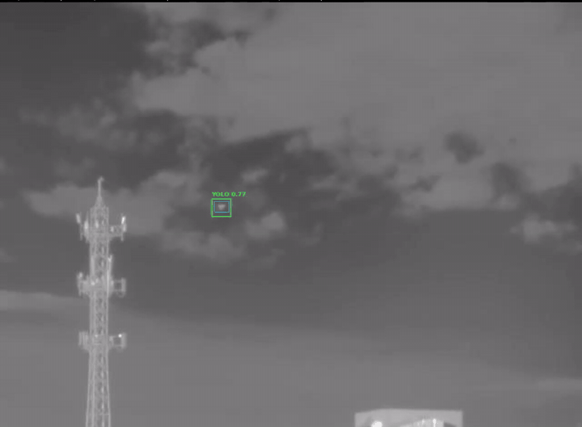
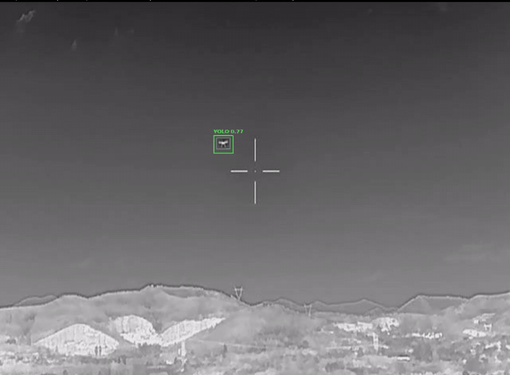
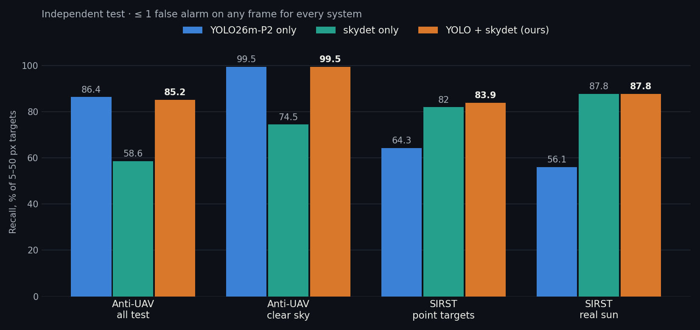
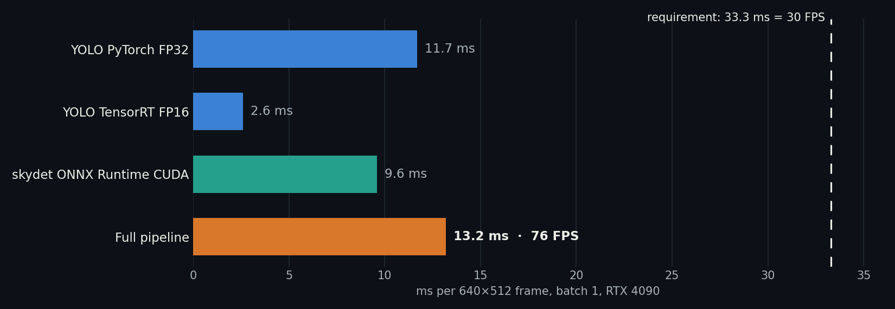
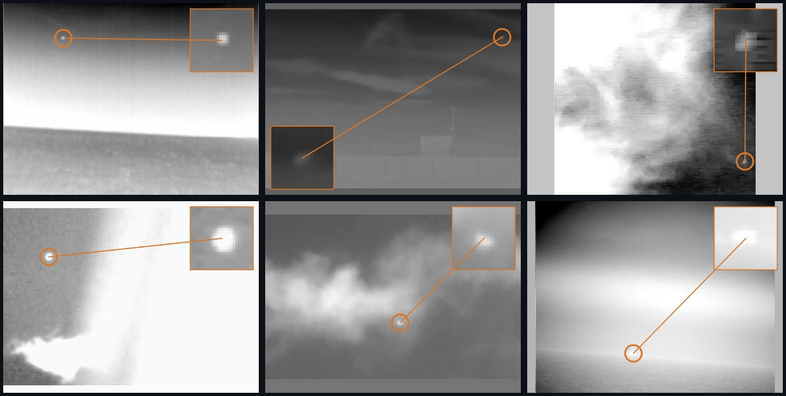
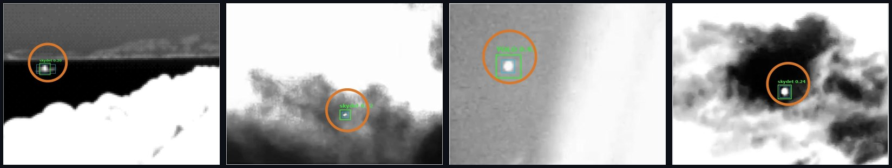

<div align="center">

# Small Thermal Target Detection

**Real-time detection of drones and birds from 5×5 pixels in 640×512 thermal video**


[Українською](README.uk.md)

 

<sub>Test sequences the model never saw during training. Green box: detection. Cyan box: ground truth.</sub>

</div>

## The task

Case 4.5 of the competition. The requirements:

| Requirement | Result |
|---|---|
| Thermal frame 640×512, targets from 5×5 px | Targets of 5 to 50 px detected; 5×5 is 0.008% of the frame |
| At least 30 FPS for the whole pipeline | **76 FPS** (13.2 ms per frame) on RTX 4090 |
| At most 1 false positive per frame | **Never more than 1** on any frame; 0.05 to 0.33 on average |
| Robust to sun and heated surfaces | **87.8%** recall on real frames with the sun, 0.10 false alarms per frame |

After talking to the mentor the target was narrowed down to small objects against the sky: drones and birds.

## How it works

```
                ┌─────────────────────────────┐
                │ YOLO26m-P2 (TensorRT FP16)  │  drones 9–50 px, 2.6 ms
 thermal frame ─┤                             ├─► fusion ─► one target per frame
   640×512      │ skydet: ADGFNet-Lite (ONNX) │  point targets 5–8 px, 9.6 ms
                └─────────────────────────────┘
```

No single model covered everything, so we use two.

* **YOLO26m with a P2 head.** The extra stride-4 feature map makes a 5–8 px target occupy one or two cells instead of a fraction of one. Trained on 141,880 sky frames from Anti-UAV410 plus synthetic sun.
* **skydet.** A 0.12M-parameter segmentation network (ADGFNet-Lite, pretrained on IRSTD-1k) followed by a sun mask, a size filter and a logistic-regression filter of false blobs. It finds tiny point targets that YOLO misses.
* **Fusion.** YOLO boxes plus skydet blobs that are not inside a YOLO box. The skydet score is scaled by 0.25 and the single best candidate is kept. One candidate per frame means more than one false alarm per frame cannot happen.

All thresholds were chosen on validation data (Anti-UAV410 val and SIRST val). The test set was not used for any choice.

## Results



Each model is strong where the other is weak. Fused, the system keeps 99.5% on clear sky and lifts point targets from 64% to 84% and frames with the real sun from 56% to 88%.

| Test set | Frames | YOLO only | skydet only | **YOLO + skydet** |
|---|---:|---:|---:|---:|
| Anti-UAV410 test, all | 21,551 | 86.4% · 0.06 | 58.6% · 0.07 | **85.2% · 0.05** |
| Anti-UAV410 test, clear sky | 5,268 | 99.5% · 0.02 | 74.5% · 0.03 | **99.5% · 0.02** |
| Anti-UAV410 test, sky with terrain | 16,174 | 82.9% · 0.07 | 54.3% · 0.08 | **81.4% · 0.06** |
| SIRST point targets | 514 | 64.3% · 0.01 | 82.0% · 0.01 | **83.9% · 0.01** |
| SIRST real sun | 105 | 56.1% · 0.08 | 87.8% · 0.08 | **87.8% · 0.10** |
| SIRST empty sky, false alarms | 255 | 0.31 | 0.17 | **0.33** |
| Anti-UAV410 empty frames, false alarms | 1,019 | 0.21 | 0.07 | **0.16** |

<sub>Recall of targets 5–50 px · false alarms per frame. A hit means the box centre lies inside the ground-truth box ±3 px. Full numbers: [`results/`](results).</sub>

### Speed



TensorRT FP16 made YOLO 4.5 times faster with identical recall. Moving skydet to TensorRT FP16 cut the model itself from 3.0 to 1.3 ms, again without any loss in recall.

### The hardest frames



Real test frames where the target is barely visible: 5 to 8 px inside bright clouds, next to rooftops, in a sun-washed sky. The orange circle marks the target, the square shows it magnified 8 times. On every one the system found the target with zero false alarms.

### Against the sun



## What we tried

| Approach | Outcome | Decision |
|---|---|---|
| Classical: top-hat, local contrast, shape filters | 20% recall on objects, lots of clutter | kept the ideas for post-filters |
| DNA-Net (BasicIRSTD) | 71 GMACs per 640×512 frame, 62% Pd on val | too heavy and weaker |
| ADGFNet-Lite (skydet) | 82% on point targets, 88% with the sun | used for point targets |
| YOLO26m-P2 | 99.5% on clear sky, 2.6 ms in TensorRT | used for drones |
| Larger input for YOLO (960, 1280 px) | YOLO alone a bit better, fused system worse and slower | stayed with 640 |

## Data

* **Anti-UAV410 SKY.** 141,880 frames in 338 sequences, only sky and sky with terrain at the edge. Train, val and test are split by sequence and recording group, so no test sequence appears in training. Negatives make up 4.8%. The manifest and builder are in [`notebooks/team_package`](notebooks/team_package).
* **Synthetic sun.** An overexposed disc with a halo added to 10% of training frames. Evaluation uses real sun frames only.
* **SIRST-v2 and IRSTD-1k.** Point targets of a few pixels for validation and testing of skydet.

Label quality was checked automatically: the median offset between confident detections and ground-truth centres is 0.95 px, with no frame shift.

Datasets are not included. See the links in [`analysis/README.md`](analysis/README.md).

## Repository layout

```
analysis/      dataset statistics and the classical baseline
skydet/        point-target detector: ADGFNet-Lite ONNX + post-filters, demo, tuning
yolo/          dataset preparation, training, fusion with skydet, evaluation by the task metric
dnanet/        DNA-Net experiments on BasicIRSTD
notebooks/     Kaggle notebooks for training and testing, and the scripts that build them
benchmarks/    TensorRT and speed benchmarks used for the final numbers
results/       metrics, per-sequence errors, precision/recall curves
assets/        images for this page
```

## Quick start

```bash
pip install -r requirements.txt

# point-target detector on a thermal video or a folder of frames
cd skydet
python demo.py --src <video.mp4 | frames_dir> --cfg config.json --out demo_out

# fused system: see yolo/fuse.py and notebooks/ensemble_test.ipynb
```

Training and testing run on Kaggle (2× T4). Open a notebook from [`notebooks/`](notebooks), set the dataset link and run all. Final benchmarks were run on a single RTX 4090.

## Team

Olena Serhiienko · Artem · Anastasiia · Illia

## Acknowledgements

* [ADGFNet](https://github.com/kuaileBenbi/ADGFNet) for the ADGFNet-Lite weights (MIT, see [`skydet/ADGFNet_LICENSE.txt`](skydet/ADGFNet_LICENSE.txt))
* [Ultralytics YOLO](https://github.com/ultralytics/ultralytics), [BasicIRSTD](https://github.com/XinyiYing/BasicIRSTD)
* Datasets: Anti-UAV410, SIRST-v2, IRSTD-1k, HIT-UAV, FLIR

## License

[MIT](LICENSE)
